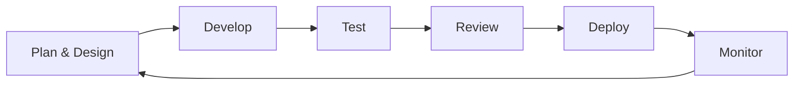

<h1 align="center">Hi, I'm Azizbek Abdunazarov</h1>

<h3 align="center">Python Backend Engineer | AI Integration Specialist | SaaS Architect</h3>

  

  
  
  
  

---

## 👨‍💻 About Me

I'm a **Python Backend Engineer** from Uzbekistan with a passion for building practical, production-ready software that solves real business problems. With a strong foundation in backend architecture, AI integrations, and SaaS development, I focus on creating scalable systems that deliver value.

**My expertise spans:**

- **Backend Engineering** — Designing and building robust REST APIs, microservices, and distributed systems with Python, Django, and FastAPI
- **AI Integrations** — Connecting large language models with business workflows through RAG, AI Agents, and intelligent automation
- **SaaS Development** — Architecting multi-tenant platforms with subscription management, secure authentication, and production-grade deployment
- **System Architecture** — Implementing clean architecture patterns, authentication/authorization, database design, and deployment strategies

I believe in writing clean, maintainable code and shipping fast without compromising quality. Whether it's building from scratch or optimizing existing systems, I approach every challenge with an **optimist's mindset** and a **problem-solver's determination**.

| | |
|---|---|
| **Main role** | Python Backend Engineer |
| **Core focus** | REST APIs, SaaS backends, AI integrations, automation |
| **Mindset** | Optimist, fast learner, creative problem solver |
| **Engineering style** | Build clean, ship fast, improve continuously |
| **Current direction** | Backend + AI + automation for business workflows |

---

## 🛠️ Tech Stack

### Backend

### Artificial Intelligence & Automation

### Databases

### DevOps & Infrastructure

### Security & Authentication

### Frontend Basics

---

## 🏗️ Architecture Experience

I design and implement production-grade backend architectures with a focus on scalability, security, and maintainability.

| Category | Technologies & Practices |
|----------|--------------------------|
| **REST APIs** | Django REST Framework, FastAPI, API versioning, pagination, filtering, throttling |
| **Authentication** | JWT, OAuth2, Social Authentication, Meta OAuth, Session Management |
| **Authorization** | Role-based access control (RBAC), Permission systems, Scope-based security |
| **External APIs** | Meta Graph API, Instagram Business API, Facebook Page API, Webhook Integration |
| **Database** | PostgreSQL, SQLite, Query optimization, Indexing strategies, Migrations |
| **Background Tasks** | Celery, Task queues, Scheduled jobs, Webhook processing |
| **Architecture** | Clean Architecture, Repository Pattern, Service Layer, DTOs |
| **Deployment** | Docker, Docker Compose, Nginx, Gunicorn, Production server configuration |
| **Security** | Webhook signature validation, CORS, CSRF, Rate limiting, Input validation |

---

## 🚀 Featured Projects

### TopNarx
Production restaurant price comparison platform helping users find the best dining deals.

**Live:** [topnarx.uz](https://topnarx.uz)

| | |
|---|---|
| **Description** | A comprehensive restaurant price comparison platform that aggregates and compares menu prices across restaurants in Uzbekistan |
| **Highlights** | Secure JWT authentication, REST API architecture, PostgreSQL optimization, Docker deployment |
| **Stack** | `Python` `Django` `DRF` `PostgreSQL` `Docker` `JWT` `Nginx` `Gunicorn` |
| **Architecture** | Service-based architecture with comprehensive API documentation via Swagger/OpenAPI |
| **Current Status** | Production ready, serving users daily |

---

### ChatPlace
AI-powered Instagram business automation platform for intelligent customer engagement.

**Live:** [chatplace.avioraai.uz](https://chatplace.avioraai.uz)

| | |
|---|---|
| **Description** | A sophisticated SaaS platform that connects Instagram Business accounts to provide AI-powered auto-replies, lead management, and CRM capabilities |
| **Highlights** | Meta Graph API integration, Webhook verification & signature validation, Instagram OAuth, Facebook Page linking, RAG-based AI responses |
| **Features** | AI auto-reply system, Knowledge base management, Multi-workspace architecture, Lead collection pipeline, Subscription-ready system, Developer mode testing |
| **Stack** | `Django` `DRF` `PostgreSQL` `OpenAI` `LangChain` `RAG` `Docker` `Meta API` `OAuth2` |
| **Architecture** | Clean architecture with service layers, webhook handlers, task queues, and secure API integration |
| **Lessons Learned** | Production-ready OAuth implementation requires careful state management, secure token storage, and robust error handling |
| **Supported** | Multiple Instagram Business accounts through Facebook Pages with secure implementation practices |

---

### AI Kutubxona
AI-based knowledge and library assistant for intelligent document retrieval.

| | |
|---|---|
| **Description** | A document-aware AI assistant that enables intelligent information retrieval and knowledge management through natural language interaction |
| **Highlights** | Retrieval-Augmented Generation implementation, document processing pipeline, FastAPI backend optimization |
| **Stack** | `FastAPI` `LangChain` `RAG` `OpenAI` `Python` |
| **Architecture** | RAG pipeline with document ingestion, vector storage, and AI-powered query processing |

---

### Neyro Brains
AI-focused project for experimenting with intelligent workflows, assistants, and automation ideas.

| | |
|---|---|
| **Description** | An experimentation platform for building and testing intelligent workflow automation, AI assistants, and creative automation solutions |
| **Stack** | `Python` `AI` `Automation` `LangChain` |
| **Focus** | Prototyping innovative AI workflows and automation strategies for business applications |

---

## 📊 GitHub Statistics

  
  

  

---

## 🐍 Contribution Graph

<picture>
  <source media="(prefers-color-scheme: dark)" srcset="https://raw.githubusercontent.com/Azizbek6002/Azizbek6002/output/github-snake-dark.svg" />
  <source media="(prefers-color-scheme: light)" srcset="https://raw.githubusercontent.com/Azizbek6002/Azizbek6002/output/github-snake.svg" />
  
</picture>

---

## 🎯 Current Focus

- **System Design** — Deepening knowledge in distributed systems, scalability patterns, and high-performance architecture
- **AI Agents** — Building autonomous systems that can execute complex workflows and make intelligent decisions
- **Cloud Infrastructure** — Exploring AWS, GCP, and advanced deployment strategies
- **Production Monitoring** — Implementing comprehensive monitoring, logging, and error tracking systems

---

## 📈 Engineering Principles

| Principle | Philosophy |
|-----------|------------|
| **Clean Code** | Write code that tells a story — readable, maintainable, and self-documenting |
| **Ship Fast** | Balance speed with quality — deliver value early and iterate continuously |
| **Production First** | Always design with production in mind — security, scalability, and reliability are non-negotiable |
| **Continuous Learning** | Every project teaches something new — embrace challenges and grow |
| **User-Centric** | Technology serves people — build solutions that solve real problems |

---

## 🧠 Currently Building

- **ChatPlace** — Finalizing Meta App Review process and preparing for production launch
- **AI Automation Framework** — Building reusable components for AI-powered business automation
- **Personal Knowledge Base** — Documenting engineering practices and architectural patterns

---

## 📚 Learning

- Advanced System Design patterns
- Distributed systems fundamentals
- Cloud-native architecture
- AI Agent frameworks
- Production security best practices
- Performance optimization techniques

---

## 🗺️ Roadmap 2026

- [ ] Launch ChatPlace production version
- [ ] Build 3 additional AI-powered SaaS platforms
- [ ] Contribute to open-source Django/DRF projects
- [ ] Develop reusable backend architecture templates
- [ ] Establish professional personal brand in the backend engineering community
- [ ] Achieve cloud certification (AWS/GCP)

---

## 🌱 Open Source

I'm actively looking to contribute to open-source projects related to:

- Django and Django REST Framework
- FastAPI applications
- AI/LLM integration tools
- Automation frameworks
- SaaS building blocks

**Open to collaboration** on interesting projects that align with my expertise.

---

## 🏅 Certifications (Coming Soon)

- [ ] Python Backend Engineering
- [ ] Cloud Architecture (AWS/GCP)
- [ ] AI/ML Engineering

---

## 🔧 Development Workflow

**My workflow emphasizes:**
- Thoughtful planning and architecture design
- Clean, testable code with comprehensive coverage
- Regular code reviews and pair programming
- Automated CI/CD pipelines
- Production monitoring and quick iteration

---

## 💡 Favorite Technologies

| Category | Top Picks |
|----------|-----------|
| **Backend** | Python, Django, DRF, FastAPI |
| **AI/ML** | OpenAI, LangChain, RAG |
| **Database** | PostgreSQL |
| **Infrastructure** | Docker, Nginx |
| **Security** | JWT, OAuth2, Webhook validation |
| **Frontend** | React, Tailwind CSS |

---

## 💼 Product Mindset

I build software with a product mindset — thinking beyond code to deliver real value to users and businesses.

- **User Experience** — APIs that are intuitive and well-documented
- **Business Value** — Solutions that solve real problems and drive growth
- **Sustainability** — Architecture that can evolve with changing requirements
- **Speed to Market** — Fast delivery without compromising quality

---

## 🤝 Available For Collaboration

I'm open to:

- **Backend Engineering Roles** — Building scalable systems and REST APIs
- **AI Integration Projects** — Connecting AI with business workflows
- **SaaS Development** — Architecting and building new platforms
- **Technical Consulting** — Advising on backend architecture and best practices
- **Open Source Contributions** — Collaborative projects in my domain
- **Mentorship** — Guiding developers in backend engineering and AI

---

## 🔍 Interesting Facts

- I approach every problem with an optimist's mindset and a problem-solver's determination
- Pressure is fuel — I thrive in challenging situations
- I break problems, pressure does not break me
- I believe in continuous improvement — code, ship, improve, repeat
- Passionate about building systems that make a difference

---

## 🌐 Connect With Me

  
  
  
  
  

---

> *"Build clean. Ship fast. Improve continuously. Create systems that make a difference."*

<h3 align="center">⚡ Code. Ship. Improve. Repeat. ⚡</h3>
